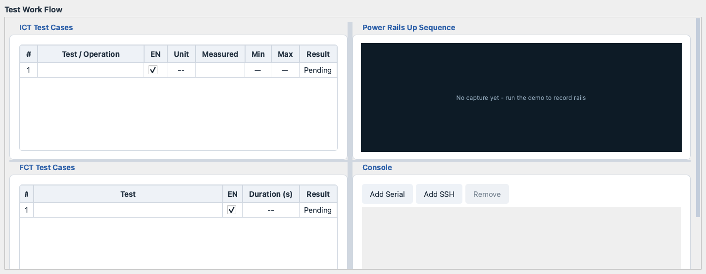
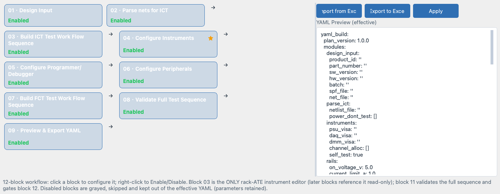
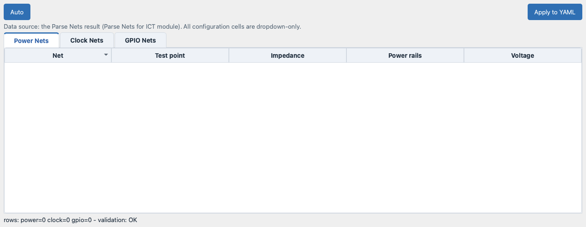

# Overview

MTK GUI (Manufacturing Test Kit) is a cross-platform manufacturing test
tool covering the complete production flow:

    ICT -> Flash FAT firmware -> FCT -> Flash OOBE firmware

- **ICT** (In-Circuit Test): fixture interlocks, impedance shorts,
  power-on, power-rails capture, DC voltage, clocks, GPIO.
- **Flash FAT**: factory acceptance firmware, flashed by a third-party
  GUI (operator confirm) or a CLI (automatic keyword parse).
- **FCT** (Functional Test): message testing - the verdict comes from
  Pass/Success vs Fail/Error keywords in the channel output, an
  operator dialog, or a CLI result.
- **Flash OOBE**: out-of-box-experience firmware, same dual path.

The Test Work Flow page renders the whole flow as one table; the
Yaml Build page (12-stage block flow) authors the project.

## Main Window Layout

The main window is titled `MTK - Manufacturing Test Kit` and is built
from three horizontal regions stacked in a vertical splitter:

- **Top** - the common area (Product Information, Run Control,
  Overall Flow, Overall Result), shared by every tab.
- **Middle** - the tabbed workspace with four pages.
- **Bottom** - the Event Log pane.

The splitter handle between the regions lets you resize them, but no
pane can ever collapse to zero: the Event Log and the status bar are
permanent system UI and keep a hard vertical floor.

### Menu Bar

The menu bar has a fixed order that never changes:
`File / View / Settings / Tools / Run / Report / Help` (Help is always
the rightmost menu).

- **File**: `Load Yaml…`, `Apply and Save Yaml`, `Save as Yaml…`,
  `Close Yaml`, `Switch Account…`, `Exit`.
- **View**: `Console Background Color…`, `Reset Background (Black)`,
  and the `GUI Theme` submenu (Light / Dark application-wide themes).
- **Settings**: `Operator Permissions…` (supervisor only),
  `Auto-SN` (checkable), `Serial Number Format Check...`,
  `Virtual Fault Injection...` (Virtual mode only).
- **Tools**: `Set All instruments` with the batch entries
  `Connect all`, `Disconnect all`, `Reset all`,
  `Test all connections`.
- **Run**: Visual Studio style shortcuts - Run (F5),
  Run Without Debug (Ctrl+F5), Stop (Shift+F5),
  Restart (Ctrl+Shift+F5), Step (F10), Step Into (F11),
  Continue (Shift+F11), Toggle Breakpoint (F9),
  Clear Breakpoints (Ctrl+Shift+F9), Run to Cursor (Ctrl+F10).
- **Report**: `Generate Report…`, `Event Log`, `Statistics`.
- **Help**: `User Guide`, `Page Guide`, `FAQ / Troubleshooting`,
  `Security & Roles`, `About`.

**Note:** On macOS the menu bar is rendered inside the window on
purpose (the native top-of-screen menu bar is disabled), so the menus
look and behave the same on Windows and macOS.

### Top Common Area

Four groups are pulled out of the Test Work Flow page and stay visible
above the tabs on every page:

- **Product Information**: `Product Part#`, `Core ID` and `Batch#`
  are 100 percent YAML-driven and read-only for every role (the
  project YAML file is the only editing entrance). `Serial Number`
  is the single per-unit manual input (format: 2 letters + digits,
  e.g. `FS1234567890`).
- **Run Control**: the primary `Run` and `Stop` buttons (idle: Run
  enabled, Stop disabled; running: swapped), plus `Long Run`
  (repeat the whole cycle 1..999 times) and `Interval`
  (pause between cycles, 0.5..99 s in 0.5 s steps).
- **Overall Flow**: the whole ICT -> Flash FAT -> FCT -> Flash OOBE
  sequence as one table; each stage has an `EN` checkbox to
  enable / disable it.

- **Overall Result**: the accumulated verdict of the current run.

### Tabs (Workspace)

Four pages cover the complete workflow:

- **Test Work Flow** - the run page. Upper row: the ICT Test Cases
  table and the Power Rails capture pane; lower row: the FCT Test
  Cases table beside the multi serial/SSH console.
- **Equipment** - the rack-ATE instrument editor: add, configure,
  connect, disconnect and test the instruments of the station.
- **Yaml Build** - the project authoring page: a fixed block-flow
  diagram (click a block to configure, right-click to enable or
  disable) next to a live YAML preview that is two-way synced with
  the diagram.
- **Channel Allocation** - dedicated Power / Clock / GPIO tables;
  the data source is the Parse Nets result of the Yaml Build model.

### Event Log

The bottom pane is the central **Event Log** (renamed from the former
Test Log and moved out of the Test Work Flow page):

- Every entry carries a date-time stamp; PASS, FAIL and Error
  verdicts are highlighted in their own colors so matching lines are
  easy to find.
- The pane auto-scrolls as new lines arrive.
- Right-click opens `Copy` / `Clear` / `Save as…`.
- Each GUI session also auto-saves one log file under the `event/`
  directory (`event/event_YYYYMMDD_HHMMSS.log`, one file from
  startup to exit, flushed line by line).

### Status Bar

The status bar is a flat row, left to right:

- `GUI version: vX.Y.Z.xxxx` (from `resources/version.json`).
- **Role** and **Mode** badges (colored, bold; refreshed by
  `File > Switch Account…`).
- `User: <os-login-name>`.
- A global progress bar: shows `Idle` when no task runs, live
  0-100 percent while running, fills full and auto-resets when the
  job finishes.
- Instrument connection LEDs: `DAQM`
  (DAQ973A + 2x DAQM908A + DAQM907A), `DAQ` (U2355A),
  `PSU` (N5747A) - green connected, gray disconnected, red error.
- Console LEDs, one per serial/SSH channel, updated live on channel
  add / remove / connect / disconnect.
- The current date (far right).

## Roles: Supervisor and Operator

Two accounts share one GUI:

- **Supervisor** - full access: every menu, every editor, YAML
  saving. The supervisor password lives only in the application
  source; it never appears in the UI or any document.
- **Operator** - runs tests and may always connect / disconnect
  instruments, but every other right is granted per key by the
  supervisor via `Settings > Operator Permissions…`. The grant set
  is persisted in `config/permissions.json`.

The permission keys the supervisor can toggle:

    save_yaml              Save YAML (Apply and Save / Save as)
    edit_yaml_build        Edit Yaml Build page (YAML config editor)
    edit_ict               Edit ICT test cases (double-click rows)
    edit_fct               Edit FCT test cases (double-click rows)
    edit_run_control       Edit Long Run / Interval
    toggle_stages          Enable / disable ICT / FCT stages (EN)
    edit_serial_params     Configure serial / SSH channel parameters
    manage_channels        Add / Remove console channels
    equipment_config       Open Equipment page configuration windows
    sn_format_check        Serial Number Format Check (Settings)
    run_policy_stop_failure  Run Policy: Stop if failure
    run_policy_stop_short    Run Policy: Stop if any short
    run_policy_auto_sn       Run Policy: Auto-SN (virtual serial, +1)

**Note:** Connecting and disconnecting instruments is always allowed
for operators and is intentionally not a permission key.

**Note:** Operators without the stage-toggle right still see the `EN`
checkboxes in Overall Flow, but they are grayed out (not clickable).

## Modes: Real and Virtual

- **Real** - the default. Every action drives the physical station:
  instruments, fixture IO and the DUT.
- **Virtual** - a supervisor-only simulation of the whole station,
  including fault injection (`Settings > Virtual Fault Injection...`).
  In Virtual mode the simulated instruments come up connected
  shortly after the GUI starts, so the full flow can be rehearsed
  without any hardware.

**Warning:** Virtual mode is unlocked only when the Account is
Supervisor AND the correct password is entered; ordinary accounts are
locked on Real mode forever.

## Fixture Types: ATE and Manual

- **ATE** - the production fixture baseline: the GUI automates
  fixture hardware configuration, IO control and fixture-linked test
  entries.
- **Manual** - bench manual debug: fixture hardware configuration,
  IO control and fixture-linked entries are globally disabled and all
  fixture / hardware actions are done by the user by hand.

**Note:** The fixture choice is made per login and is NOT persisted -
a restart always returns to the ATE baseline.

**Note:** After a Manual login (and again whenever a blocked fixture
or IO entry is used) the GUI shows the notice:

    当前为Manual Fixture模式，无IO资源自动控制权限，
    所有夹具动作、硬件操作需由用户手动自行操作

which means: this is Manual Fixture mode, there is no automatic IO
resource control; all fixture movements and hardware operations must
be performed manually by the user.

## User Guide Chapters

- **Chapter 1 - Overview** (this file): product positioning, main
  window layout, roles, modes and fixture types.
- **Chapter 2 - Getting Started**: installation, the login dialog,
  a suggested first-run sequence, Event Log basics, themes and
  window geometry memory.
- **Chapter 3 - Page Guide**: the four tabs (Test Work Flow,
  Equipment, Yaml Build, Channel Allocation) field by field.
- **Chapter 4 - Instruments & Connections**: the Equipment page,
  instrument configuration and connection management.
- **Chapter 5 - Test Items**: ICT and FCT test cases, step editing
  and how verdicts are produced.
- **Chapter 6 - Reports & Logs**: DUT / batch reports, statistics
  and the auto-saved session log files.
- **Chapter 7 - FAQ / Troubleshooting**: common problems and their
  solutions.
- **Chapter 8 - Security & Roles**: accounts, operator permissions,
  credentials and the OS keyring.
- **Chapter 9 - Yaml Build**: the fixed block-flow sequence
  (Design Input, Parse nets for ICT, Configure Instruments, the
  ICT workflow builder, Programmer/Debugger, Peripherals, FCT
  sequence, Validate, Preview & Export) and the live YAML preview.
- **Chapter 10 - Channel Allocation**: Power / Clock / GPIO channel
  mapping tables and applying them back to the project YAML.
- **Chapter 11 - Virtual Mode & Fault Injection**: rehearsing the
  full flow without hardware and configuring random faults.
- **Chapter 12 - Shortcuts & Tips**: the Visual Studio style run and
  debug shortcuts, themes, and window / pane sizing behavior.
