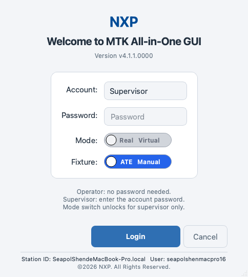

# Getting Started

1. Install: Python 3.9+, `pip install -r requirements.txt`
   (PySide6, pyserial, paramiko, PyYAML, openpyxl, keyring).
2. Launch: `python main.py` (or the packaged executable).
3. Login: **Supervisor** (password required, full access, may switch
   to Virtual mode) or **Operator** (no password, permissions are
   granted by the Supervisor, always Real mode).
4. Load a project: `File > Load Yaml...` (project-format YAML, e.g.
   `projects/96317/A-96317_96317_EVT-(Proto-1)_rev1.1.yaml`).
5. Run: F5 on the Test Work Flow page. Without a YAML the run is
   blocked on purpose.
6. Real vs Virtual: Virtual (Supervisor-only) simulates the whole
   station incl. fault injection; Real drives the physical rack.

The sections below walk through each step in detail.

## Starting the Application

- Run `python main.py` from the repository root, or start the
  packaged executable.
- The application uses the Fusion style and applies the GUI theme
  saved from the previous session (Light on a fresh install).
- The first thing you see is the login dialog - the GUI cannot be
  used without picking an account.

## The Login Dialog

The login dialog is titled `MTK GUI - Login`, shows the brand logo,
the greeting `Welcome to MTK All-in-One GUI` and the GUI version, and
pops up centered on the primary screen.

### Fields (fixed top-to-bottom order)

- **Account** - a dropdown with the two roles:
  - **Supervisor**: full access; requires the account password.
  - **Operator**: no password; every right except running tests and
    connecting / disconnecting instruments must be granted by the
    supervisor (see `Settings > Operator Permissions…`).
- **Password** - masked input. Only the Supervisor account is
  validated; Operator ignores this field.
- **Mode** - a slide switch, left `Real` (green, physical hardware,
  the default) / right `Virtual` (purple, simulated station). The
  switch starts disabled and grayed (forced Real).
- **Fixture** - a slide switch, left `ATE` (blue, production fixture
  auto test, the default) / right `Manual` (amber, bench manual
  debug). Single selection, mutually exclusive.

The hint text under the form summarizes the rules:

    Operator: no password needed.
    Supervisor: enter the account password.
    Mode switch unlocks for supervisor only.

### Supervisor unlock rule

The Mode switch unlocks live while you type: only when the Account
dropdown reads **Supervisor** AND the correct password has been
entered does the switch turn from grayed to active. Any other
combination forces the switch back to Real.

**Warning:** Virtual mode is a supervisor-only capability. An
operator account is locked on Real mode forever, even if the switch
was left on Virtual by a previous supervisor session.

### Buttons

- **Login** - the primary accent button. Validates the supervisor
  password when needed and opens the main window with the chosen
  role, mode and fixture type.
- **Cancel** - secondary button. **Note:** it is hidden at startup
  (you must pick an account to continue); it is available when the
  dialog is reopened via `File > Switch Account…`.

### Bottom info bar

The fixed footer of the dialog shows:

- **Station ID** - the current computer host name (system-derived,
  never manually editable).
- **User** - the current OS login account name (system-derived).
- The copyright line `©2026 NXP. All Rights Reserved.`

### Wrong password

If the supervisor password does not match, a `Login Failed` message
box appears (`Wrong supervisor password.`), the password field is
reselected so you can retype immediately, and the dialog stays open.

## Switching Accounts

- `File > Switch Account…` reopens the login dialog at any time.
  The Role and Mode badges in the status bar are refreshed after the
  switch, and the operator permission set is re-applied to every
  page.

## Suggested First-Run Sequence

A safe path from a fresh install to the first verdict:

- **Step 1 - Configure the equipment.** Open the **Equipment** tab,
  add the rack instruments (DAQM = DAQ973A + 2x DAQM908A + DAQM907A,
  DAQ = U2355A, PSU = N5747A), set their addresses and connect them.
  In Virtual mode the simulated instruments connect themselves
  shortly after startup, so this step can be skipped for a first
  look.
- **Step 2 - Create / load the project.** Either load an existing
  project YAML (`File > Load Yaml…`) or author a new one on the
  **Yaml Build** tab: click the blocks left to right
  (Design Input, Parse nets for ICT, Configure Instruments, the ICT
  workflow builder, Programmer/Debugger, Peripherals, Build FCT
  Test Work Flow Sequence, Validate Full Test Sequence, Preview &
  Export YAML) and confirm with Apply to save the YAML.
- **Step 3 - Review the channel allocation.** Open the
  **Channel Allocation** tab: the Power / Clock / GPIO tables are
  filled from the Parse Nets result; adjust the mapping and use
  Apply to persist it into the project YAML.
- **Step 4 - Run.** On the **Test Work Flow** tab enter the Serial
  Number, then press **Run** (F5) in the Run Control panel or via
  the Run menu. The status bar progress bar goes live and the Event
  Log narrates every phase.
- **Step 5 - Check the results.** The Overall Result group shows the
  accumulated verdict; the Event Log highlights PASS / FAIL / Error
  lines. Use `Report > Generate Report…` for the DUT / batch report.

**Note:** Without a loaded project YAML the run is blocked on
purpose - this is a guard, not a bug.

**Warning:** In Manual fixture mode all fixture movements and
hardware operations are manual: the GUI shows the Manual Fixture
notice and disables IO resource automation. Make sure the fixture is
in a safe state before starting a run.

## Event Log Basics

The Event Log pane at the bottom of the main window is the central
activity record:

- Every line is stamped with the date and time
  (`YYYY-MM-DD HH:MM:SS`).
- Verdict keywords are color-highlighted: PASS in green, FAIL in
  red, Error in orange.
- Right-click the pane for `Copy` (copies the selection, or the
  whole log when nothing is selected), `Clear` (clears the visible
  pane; the session file keeps the full audit trail and gets a
  separator line) and `Save as…` (write the visible content to a
  file of your choice).
- Independently of the pane, each GUI session auto-saves one file
  under the `event/` directory: `event/event_YYYYMMDD_HHMMSS.log`,
  opened at startup, appended and flushed line by line, so even a
  crash leaves the record on disk.

**Note:** The Event Log is read-only; it is fed by the workflow page,
the Yaml Build tasks and the application itself (version and build
info lines appear at startup).

## Themes and Colors

- `View > GUI Theme` switches the whole application between the
  **Light** and **Dark** themes; the choice is persisted and
  restored on the next start (the login dialog follows the saved
  theme too).
- `View > Console Background Color…` changes the background of the
  serial / SSH console channels; `View > Reset Background (Black)`
  restores the default black console background.

**Note:** Theme switches change fonts and metrics; the window
re-checks its minimum height afterwards so the Event Log and status
bar are never clipped.

## Window Geometry Memory

- A window size you set manually is remembered: the next start
  restores the saved geometry instead of the automatic fit.
- A restored size is clamped to the current screen (a geometry saved
  on a larger display never overflows a smaller one) and the window
  is re-centered.
- Without any saved geometry the window auto-fits the current
  screen: optimal size, centered, never oversized.
- All dialogs pop up centered on the primary screen.

## Credentials and the OS Keyring

SSH and console credentials used by the FCT channels are resolved
through the credential layer, in this order:

- The OS keyring (service `mtk-gui`, account = credential ref).
- The environment variable `MTK_CRED_<REF>` fallback - when this is
  used, a loud warning is shown in the Event Log and on the affected
  channel dialog.
- Neither source available -> the channel open fails with a clear
  reason; nothing is guessed.

**Warning:** Credentials are never stored in plaintext files by the
application. If the keyring is unavailable (headless machines,
missing backend), set the `MTK_CRED_<REF>` environment variables
instead.
