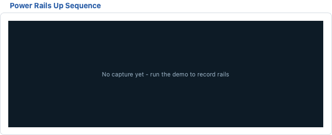

# Test Work Flow

The **Test Work Flow** page is the operator's main workspace. It
combines run control, the Overall Flow stage overview, product
information, the per-step ICT / FCT test tables, the Power Rails Up
Sequence waveform and the multi-channel Console (see chapter
`07_console.md`). A run executes the enabled stages strictly in order:
**ICT first, then FCT**.


## Page Layout

- **Top row** (above the tabs, always visible): `Product Information`,
  `Run Control`, `Overall Flow` and `Overall Result`.
- **Middle row**: `ICT Test Cases` (left, 50%) and
  `Power Rails Up Sequence` (right, at most 50% of the row width).
- **Bottom row**: `FCT Test Cases` (left, 50%) and the embedded
  `Console` (right, 50%).
- All rows can be resized with the splitter handles; panes never
  collapse.
- Page-wide log lines are routed to the central **Event Log** at the
  bottom of the main window (not shown on this page anymore).

## Run Control


### Run and Stop

- **Run** (green play button): starts a run, or continues from a paused
  breakpoint. Shortcut `F5`. This is a "Start / Continue" button: while
  the engine is paused at a breakpoint, pressing it resumes the run.
- **Stop** (red stop button): interrupts the current run. Shortcut
  `Shift+F5`.
- Button availability mirrors the engine state:
  - Idle: **Run** enabled, **Stop** disabled.
  - Running: **Run** disabled, **Stop** enabled.
- `Long Run:` repeats the whole cycle 1-999 times. `Interval (s)` sets
  the pause between cycles (0.5-99 s, 0.5 s step, default 2.0) and is
  only editable while Long Run is greater than 1. Long Run skips the
  product information input between cycles.

### Debug Controls (Run menu)

The Run menu carries the Visual-Studio-style debug actions:

- `Run Without Debug` (`Ctrl+F5`): run once while ignoring every
  breakpoint.
- `Restart Run` (`Ctrl+Shift+F5`): abort the current run, then start a
  fresh one as soon as the abort has settled.
- `Step Over` / `Step Into` (`F10` / `F11`): execute exactly one more
  workflow node, then pause again (engine granularity is one workflow
  node).
- `Step Out` (`Shift+F11`): leave single-step mode and resume.
- `Toggle Breakpoint` (`F9`): toggle the breakpoint of the current row
  of the focused ICT / FCT table.
- `Clear All Breakpoints` (`Ctrl+Shift+F9`): remove every breakpoint.
- `Run to Cursor` (`Ctrl+F10`): place a temporary breakpoint on the
  current row, start / continue, and remove it again as soon as it is
  hit.

Breakpointed rows show a `●` prefix (red, bold) in the `#` column with
a `breakpoint` tooltip. A breakpoint pauses the run **after** the node
completes, at the next safe step boundary.

### Run Gates and Pre-Test

When **Run** is pressed the following checks run before any test step:

1. A project YAML must be loaded, otherwise a warning appears:
   `No Test Project ... File > Load Yaml` and the run is blocked.
2. At least one Overall Flow stage must be enabled, otherwise the
   warning `No Available Tests` appears.
3. **Auto-SN** (if enabled in the Settings menu) fills virtual product
   information: empty fields get defaults (`VIRTUAL-PART`, `000000`,
   `freebatch`) and the serial number auto-increments
   (`VS0000000001`, +1 per run).
4. **Pre-test Serial Number Format Check** (configured in the Settings
   menu): the serial must be `<prefix>` + `<SN length>` digits. On
   failure a critical dialog appears, every test item stays blank and
   the Overall Result becomes `IGNORE`.

While the run works in the background, the phase hint above the big
verdict shows `Init...`, `Connecting console...` or `Processing...`,
and the status-bar progress bar tracks the current step
`(current / total)`. The Product Information group is disabled while a
run is active.

### Stopping a Run

- Pressing **Stop** leaves the not-yet-executed items blank and the
  Overall Result becomes `IGNORE` (only when no item failed).
- **FAIL wins over Stop**: a stopped run that already has FAIL items
  reports `FAIL`, never `IGNORE`.
- In Virtual mode the verdict text is prefixed, e.g. `Virtual PASS`.

### Overall Result

- Big verdict label: `—` (nothing judged), `RUNNING`, `PASS`, `FAIL`,
  `IGNORE` (or `Virtual <verdict>` in Virtual mode).
- Statistics line underneath, counted **per product** (one complete
  test cycle), not per individual item:

```text
Passed: 12 | Failed: 1
Yield: 92.3 % | Cycle Time (avg): 41.20 s
```

## Overall Flow

The Overall Flow group shows the currently loaded project file and the
two test stages.

- `Project File:` name of the loaded YAML (the full path is shown as a
  tooltip and the label is mouse-selectable). `(none)` when no project
  is loaded.
- Stage table columns: `#`, `Stage`, `EN`, `Status`,
  `Duration (s)`.
  - Row 1 - **ICT**: In-Circuit Test, 80 power nets impedance ->
    voltage -> RTC / CLKOUT1 / CLKOUT2 clocks (shown as a tooltip).
  - Row 2 - **FCT**: Functional Test, LED -> Serial Console (Linux) ->
    Wi-Fi -> Bluetooth -> Flash FAT -> Flash OOBE (tooltip).
- The `EN` checkbox enables / disables a stage. A disabled stage is
  reported as `Skip` when the run reaches it, and every toggle is
  logged (`Overall Flow ICT enabled` / `disabled`).
- `Status` shows `Pending` before, `Running` during and the verdict
  after; `Duration (s)` shows the stage time.

### Stop Policy

Two checkboxes control when a failing run aborts early:

- `Stop if failure` (default **OFF**): any test / operation that
  reports FAIL aborts the whole run immediately when checked.
- `Stop if any short` (default **ON**): applies to every Impedance
  Shorts test. A short under power can damage the board, so the run
  aborts right there - before `Power On DUT`.

**Note:** impedance shorts are intentionally sequenced before the DUT
is powered on; keep `Stop if any short` enabled unless you know the
board is safe.

## Product Information

The Product Information group holds the product identity fields.

### Read-Only Rule

- `Product Part#`, `Core ID` (max 6 digits) and `Batch#` are **100%
  YAML-driven and read-only for every role** (including Supervisor).
  The project YAML file is the only valid editing entrance; the fields
  start empty and refresh only on a YAML load / switch.
- An empty `Batch#` is sent to reports and logs as `freebatch`.

### Serial Number

- `Serial Number` is the single per-unit manual input: format is
  2 letters + digits, e.g. `FS1234567890` (lowercase input is forced
  to uppercase).
- The pre-test format check (prefix + digit count, configured in the
  Settings menu) validates it before every run.

### Auto-SN

- `Settings > Auto-SN (virtual serial, +1 per run)` is a checkable
  action. When active, all four fields are disabled and fully virtual:
  defaults are filled automatically on Run and the serial counter
  increments each cycle.

## ICT Test Cases

The ICT table executes strictly top -> bottom. Columns:

- `#` - execution order (with the `●` breakpoint marker when set).
- `Test / Operation` - step name; standard operations are blue and
  bold, measurement tests plain.
- `EN` - single-click the checkbox to enable / disable the step.
- `Unit` - measurement unit (`Ω`, `V`, `Hz`, `ch`); `—` for operations.
- `Measured` - measured / captured value, filled during the run.
- `Min` / `Max` - numeric limits; Impedance Shorts has only a Min
  threshold (Max stays blank).
- `Result` - `PASS` / `FAIL` for tests, `Done` / `Error` for standard
  operations.

The factory sequence (17 steps): `Init Instruments`, `Fixture Clamp
Down`, `Fixture Lock`, `Fixture E-Stop Healthy`, `Impedance Shorts
(80 pts)` (Min 1.5 Ω), `Power On DUT`, `Power Voltage (80 pts)`
(3.201-3.399 V), `RTC - 32.768 kHz`, `CLKOUT1 - 4 MHz`,
`CLKOUT2 - 6 MHz`, `ADC Stimulus AO0/AO1 -> TP_ADC` (±12 V), `Fixture
DIO (16 ch, 4 used)`, `DUT GPIO (24 ch)`, `Power Off DUT`, `Fixture
Unlock`, `Fixture Release`, `Reset Instruments`.

### During the Run

- The row being executed is highlighted (amber) and scrolled into
  view.
- `Measured` updates as each measurement completes.
- In Virtual mode result texts carry the `Virtual` prefix.

### Context Menu (right-click a row)

- `Breakpoint` - pause the run after this node completes.
- `Simulate FAIL on next run` - measurement rows only; forces a FAIL
  on the next run to exercise the stop policies.
- `Edit comment...` - free-text note per node, shown as the row
  tooltip and archived to the project YAML (follows the ICT edit
  permission).

## FCT Test Cases

The FCT table lists the functional / message test cases. Columns:
`#`, `Test`, `EN`, `Duration (s)` (filled after execution) and
`Result` (`PASS` / `FAIL` / `Error`).

The factory sequence (7 steps): `MessageYesNo: LED Test`, 
`CapturefromConsole: COM1, 'Linux version' (expected)`,
`WaitforConsole: COM1, 'Pass' or 'OK' (expected)`,
`SendtoCLI: "wifi_test --scan"`, `SendtoCLI: "bt_test --scan"`,
`MessageGoStop: Flash FAT Firmware`, `MessageGoStop: Flash OOBE
Firmware`.

### FCT Test Methods

- `MessageOK` / `MessageYesNo` / `MessageGoStop` - operator dialogs
  (OK / Yes-No / GO-STOP). Closing the dialog counts as No / STOP and
  fails the step.
- `SendtoConsole` / `WaitforConsole` / `CapturefromConsole` -
  serial-console keyword judgement (see `07_console.md`).
- `SendtoCLI` / `WaitforCLI` / `CapturefromCLI` - host CLI variants
  with the same message parsing.
- `Delay` - plain wait (ms).
- `WIFI` / `Bluetooth` - RF connectivity via CLI or vendor tool
  (`iperf3`, `wifi_test`, `bt_test`).
- Keyword judgement follows the **negative-wins** rule: any
  `Fail` / `Error` keyword beats a later `Pass` in the same captured
  batch.

## Editing Steps (Sequence Editor)

Double-click any cell of the ICT or FCT table to open the sequence
editor. It works on a **copy** of the step lists; only **Ok** writes
the changes back and refills the table.

### Editor Buttons

- `Move Up` / `Move Down` - reorder the selected step.
- `Add` - dropdown with every supported step type; the new step is
  inserted after the current row and its edit dialog opens immediately.
  - ICT: every standard `Operation:` (with its default parameters),
    `Operation: Custom` and `Test (measurement)`.
  - FCT: standard operations first, then one entry per test method
    (`MessageOK`, `MessageYesNo`, `MessageGoStop`, `SendtoConsole`,
    `WaitforConsole`, `CapturefromConsole`, `Delay`, `SendtoCLI`,
    `WaitforCLI`, `CapturefromCLI`, `WIFI`, `Bluetooth`).
- `Remove` - delete the selected step (disabled when only one step
  remains).
- `Edit` - open the edit dialog for the selected step (double-click a
  list entry does the same).
- `Duplicate` - copy the selected step to the next position.
- Every list row carries an enable checkbox.

### Step Edit Dialog (ICT measurement)

Fields, in order:

- `Test Method` - `op`, `test`, `Static Impedance`, `Power Voltage`,
  `Clock Hz`, `DAQ AI`. Changing it updates the fields below.
- `Net` - the net name. The offered choices come **per test method**
  from the Yaml Build parse result: Power nets for `Static Impedance`,
  `Power Voltage` and `DAQ AI`, Clock nets for `Clock Hz`, GPIO nets
  for the generic `test`. A legacy name outside the category stays
  selectable (prepended to the list).
- `Enable`, `Wait` (0-99999 ms, pause before the step) and `Timeout`
  (0-999999 ms, maximum step time).
- `Unit` - read-only, auto-filled by the method (`Ω` / `V` / `Hz`).
- `Expected`, `Min`, `Max` - numeric fields; `—` means "no value".

### Operation Step Edit

Standard operations (`Init Instruments`, fixture steps, `Power On /
Off DUT`, ...) open a per-type parameter editor:

- Instruments / reset operations: checkboxes for `DAQM`, `DAQ`, `PSU`.
- Fixture operations: `Signal` (`press` / `inpos` / `estop`) and
  `Level` (`H` / `L`).
- `Power On DUT`: `Voltage` (0-60 V) and `Current limit` (0-12.5 A);
  `Power Off DUT` has no setpoints (N5747A output OFF).

### FCT Step Edit

- `Name` - free text; the quoted segments are the command / keywords
  used by the console methods.
- `Test Method` - one of the twelve FCT methods.
- `Enable`, `Wait`, `Timeout`.

**Note:** steps changed here live on the page; use the YAML save /
apply flow (the main window offers it after sequence builders run) to
persist them into the project file.

## Power Rails Up Sequence



The right half of the middle row draws the power-rail ramp-up capture:
the critical rails (from the project YAML) are recorded by the
U2355A analog inputs while the run executes the DAQ AI capture step,
saved as a CSV log under `logs/` and drawn here as a waveform. It is a
**record-only** view - there is no pass / fail judgement.

- Legend at the top: one colored entry per rail with its nominal
  voltage, e.g. `VDD_3V3 (3.30 V)`.
- Y axis: voltage; the top of the scale is 110% of the highest nominal
  rail. X axis: time in seconds; the capture may start **before**
  power-on (negative start, default -0.5 s), so the t=0 ramp is
  visible.
- Default capture: 6.0 s duration at 200 Hz sample rate (both
  configurable per project).
- In Virtual mode a `VIRTUAL DATA (simulated)` badge marks the capture
  as simulated.

### "No capture yet"

Before any capture the plot shows the placeholder text:

```text
No capture yet - run the demo to record rails
```

The waveform appears as soon as a run executes the DAQ AI capture
step, and it is cleared again at the start of every new run (re-captured
when the step executes). Loading a project with a different rail set
also clears it.

### Rail Visibility Checkboxes

Below the waveform one checkbox per rail (tick = show its curve),
built from the YAML rail set. Untick a rail to hide it without
re-running.

### Properties and AI Review

Double-click the waveform to open `Power Rails — Properties`:

- `Properties` tab: `Capture Start` (-10 to 0 s, negative = before
  power-on), `Capture End` (0.1-30 s), computed `Duration`,
  `Sample Rate` (1-250000 Hz, the U2355A aggregate limit) and
  `Record waveform data to DAQ csv file`, plus a read-only rail table
  (`Rail`, `Color`, `Nominal V`, `Ramp Offset (s)`).
- `AI Review` tab: a rule-based review of the sampled waveform
  parameters with a `Re-analyze` button.
- On **Ok** the new capture settings are applied, the waveform is
  regenerated and the rail configuration is synced into the Yaml Build
  model so it lands in the project YAML preview.

## How Permissions Affect the Page

Run / Stop and console Open / Close stay available for every role.
Everything else follows the supervisor-granted permission keys:

- `edit_ict` / `edit_fct` - double-click editing of the ICT / FCT
  tables and the `Edit comment...` context-menu entry. Without the
  key an information box explains that the operator account cannot
  edit the table.
- `toggle_stages` - the Overall Flow `EN` checkboxes. Without the key
  they stay visible but grayed out (not clickable).
- `run_policy_stop_failure` / `run_policy_stop_short` - the two stop
  policy checkboxes.
- `run_policy_auto_sn` - the Auto-SN settings action.
- `edit_run_control` - the `Long Run` / `Interval` fields.
- Product `Part#` / `Core ID` / `Batch#` are read-only for every role
  (YAML is the only editing entrance).
- Console-specific keys are described in `07_console.md`.

## Common Errors and Recovery

- **Run blocked: no YAML file loaded** - load a project with
  `File > Load Yaml` first; the page starts empty by design (one
  placeholder row per table, no rails, no consoles).
- **Pre-test Failed (serial format)** - correct the Serial Number or
  adjust the format rule in the Settings menu; both fields empty means
  no check.
- **Console Connect Failed popup** - the pre-FCT auto-connect could
  not open every console channel; the run stops. Check the console
  parameters and connections (see `07_console.md`), then run again.
- **A stage shows Skip** - its `EN` checkbox is unticked; a supervisor
  (or an operator with `toggle_stages`) can re-enable it.
- **Overall Result IGNORE after Stop** - expected for a manual stop
  without failed items; FAIL items still report FAIL.
- **Breakpoint pauses the run unexpectedly** - the `●` marker in the
  `#` column shows where; press `F5` to continue or
  `Ctrl+Shift+F9` to clear all breakpoints.
