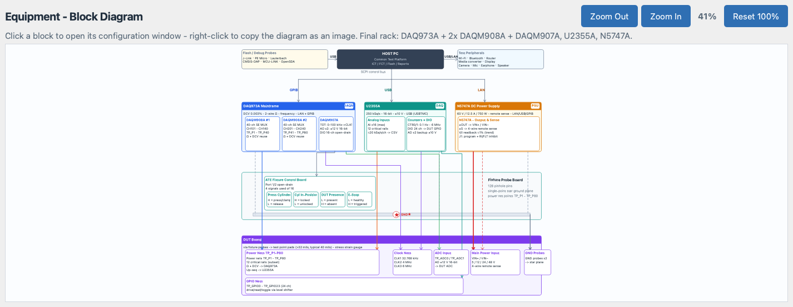

# Equipment Page

The **Equipment** tab shows the complete test rack as a clickable
block diagram: HOST PC, instruments, fixture hardware and the DUT
board, wired exactly like the physical station. Every named block
opens its own configuration window - this is the only place where
the instrument connection parameters (interface, address,
parameters) are configured for the whole application.



## What the Diagram Shows

The diagram is drawn in four layers (top to bottom):

- **Layer 1 - control**: `HOST PC` (Common Test Platform: ICT / FCT
  / Flash / Reports) in the center, `Flash / Debug Probes` on the
  left (J-Link, PE Micro, Lauterbach, CMSIS-DAP, MCU-LINK,
  OpenSDA) and `Test Peripherals` on the right (Wi-Fi, Bluetooth,
  router, media converter, display, camera, mic, earphone,
  speaker). The three connect down to the instruments over the
  **SCPI control bus** (GPIB / USB / LAN branches).
- **Layer 2 - instruments** (the final rack):
  `DAQ973A + 2x DAQM908A + DAQM907A, U2355A, N5747A`.
  - `DAQ973A Mainframe` (6.5-digit DMM, 3 slots) with `DAQM908A #1`
    (CH101-CH140, TP_P1 - TP_P40), `DAQM908A #2` (CH201-CH240,
    TP_P41 - TP_P80) and `DAQM907A` (totalizer for CLK1, 2x analog
    output, 16-ch open-drain DIO).
  - `U2355A` USB DAQ, drawn as `Analog Inputs` (12 critical rails,
    about 20 kSa/s per channel to CSV) and `Counters + DIO`
    (CTR0/CTR1 for CLK2/CLK3, 24-ch DIO to the DUT GPIO).
  - `N5747A DC Power Supply` (60 V / 12.5 A / 750 W, 4-wire remote
    sense) with its `Output & Sense` detail block.
- **Layer 3 - fixture**: `Fixture Probe Board` (128 pinhole pins,
  single-point star ground plane, power net points TP_P1 - TP_P80)
  with the star-ground marker, the `ATE Fixture Control Board`
  (driven by DAQM907A Port 1/2, 4 signals used of 16) and four
  fixture cells: `Press Cylinder` (output), `Cyl In-Position`,
  `DUT Presence` and `E-Stop` (inputs, active-low).
- **Layer 4 - DUT**: `DUT Board` with the test object groups
  `Power Nets TP_P1-P80`, `Clock Nets` (CLK1 32.768 kHz, CLK2 4 MHz,
  CLK3 6 MHz), `ADC Input`, `Main Power Input` (VIN+ / VIN-),
  `GND Probes` and `GPIO Nets TP_GPIO0 - TP_GPIO23`.

The colored signal trunks show who measures what: blue = DAQM908A
impedance/voltage scan, orange = U2355A power-rails up-sequence
tap-off, purple = clocks (907A totalizer + U2355A counters), green =
analog output stimulus to the ADC, red = supply power plus the
dashed remote-sense line, gray = ground drops to the star plane.

## Interacting with the Diagram

- **Click a block** (left mouse button) to open its configuration
  window. Every named block is clickable; the cursor turns into a
  hand and each block carries the tooltip `Click to configure`.
- **Right-click** anywhere on the diagram and choose
  `Copy Diagram as Image` to render the whole diagram to the system
  clipboard (2x scale for crisp pasting into documents or tickets).
  A tooltip `Block diagram copied to clipboard` confirms the copy.
- **Zoom**: the header row offers `Zoom Out`, `Zoom In`, a live zoom
  percentage label and `Reset 100%` (back to true 1:1 pixels).
  Zooming works in steps of 25% / 20% and is limited to the range
  10% - 1000%. On open and on window resize the diagram auto-fits
  the whole rack into the view; the auto-fit switches off as soon as
  you zoom manually.

**Note:** the diagram opens fitted to the window. Use `Reset 100%`
when you need the true block sizes, for example to take
documentation screenshots.

## Instrument Configuration Windows

Clicking an instrument block (`DAQ973A Mainframe`, `DAQM908A #1`,
`DAQM908A #2`, `DAQM907A`, `U2355A`, `N5747A`) opens a rich
configuration window with four group boxes plus a `Test Log`.

### Instrument Information

Read-only identity and specification fields (model, slots, built-in
DMM accuracy, scan speed, interfaces, status). Use it to verify you
are configuring the right resource before changing anything.

### Parameter Configuration

Editable instrument parameters, persisted with the project:

```
DAQ973A   Scan speed (ch/s) = 450   Timeout (ms) = 2000   NPLC = 1.0
DAQM908A  Wire mode = 2-wire        Bias source = off
DAQM907A  Totalizer gate (s) = 1    AO0 (V) = 0.0  AO1 (V) = 0.0
U2355A    Sample rate (kSa/s) = 20  Range (V) = 10  Averaging = 1
N5747A    Voltage set (V) = 12.0    Current limit (A) = 2.0
          OVP (V) = 15.0
```

### Connection

- **Interface** dropdown and **Address** field. Switching the
  interface fills the matching default VISA-style address, for
  example `GPIB0::9::INSTR`, `TCPIP0::192.168.1.10::inst0` or
  `USB0::0x2A8D::0x0101::MY01000001::INSTR`. The DAQM908A /
  DAQM907A modules connect `via DAQ973A` (slot 1 / 2 / 3 on
  `GPIB0::9`) - they have no address of their own.
- **Connect** starts the link; the status label shows
  `Connecting ...` for a moment, then the result.
- **Test Connection** (available once connected) sends `*IDN?` and
  logs the identification string, for example
  `Keysight Technologies,DAQ973A,MY01000001,A.01.10` followed by
  `Test Connection -> OK`.
- **Disconnect** closes the link, resets the status light and
  disables the action buttons again.
- A round **LED** plus a status text show the current state:
  gray `Disconnected`, green `Connected (virtual)`, red
  `Error: no hardware (demo)`.

**Note:** the edited connection (interface, address) and parameter
values are saved with the project YAML and restored the next time
the window opens, so a saved project reconnects directly. The
connect state itself lives on the page: closing and reopening the
window keeps `Connected`.

**Warning:** in the demo build (no VISA layer) every real connect
fails with `Error: instrument not found (demo build has no VISA
layer)`. In **Virtual mode** (supervisor login) `Connect` and
`Test Connection` succeed with a simulated link and the window note
reads `Virtual mode - connect / test succeed (simulated).`

### Control & Simple Tests

Simulated one-click actions feeding the `Test Log` area, which takes
the lower half of the window. The buttons enable after a successful
connect and use the values from `Parameter Configuration`:

- DAQ973A: `Measure DCV`, `Measure 2-wire Ω`, `Measure Frequency`,
  `Self Test`.
- DAQM908A #1 / #2: `Scan CH101 - CH140` / `Scan CH201 - CH240`,
  `Relay Self Test`.
- DAQM907A: `DIO Write`, `DIO Read`, `Totalizer (CLK1)`,
  `AO Output`.
- U2355A: `AI Read (12 rails)`, `Counter CTR0 (CLK2)`,
  `Counter CTR1 (CLK3)`, `DIO Loopback`.
- N5747A: `Power ON`, `Power OFF`, `Read V/I` (readback about 1%).

**Warning:** the whole `Control & Simple Tests` group is disabled in
**Manual Fixture mode** - the operator performs every hardware
action by hand.

## Read-Only Blocks

Non-instrument blocks open lighter windows - they document the rack
instead of configuring it:

- `Flash / Debug Probes` and `Test Peripherals` show a table with
  the columns `Item` / `Role` / `Interface / Status`.
- All other blocks (HOST PC, fixture board, fixture cells, DUT
  groups, instrument detail blocks) show a read-only form of the
  block's specifications.

These windows carry the note `Demo mode - no hardware connected.`
and a `Close` button.

## Connection Status Indicators

- **In the configuration window**: the round LED described above.
- **In the status bar** (bottom of the main window): the
  `Instruments:` LED row with three permanent lights - `DAQM`
  (DAQ973A + 2x DAQM908A + DAQM907A), `DAQ` (U2355A) and `PSU`
  (N5747A). Colors: green = connected, gray = disconnected,
  red = error; hover a light for the full instrument name and
  state.
- The status-bar LEDs follow the Equipment page connect /
  disconnect live. They are never force-green: even in Virtual mode
  the operator connects manually and the LEDs follow that state.

## Instruments at a Glance

- **DAQ973A mainframe** - 6.5-digit DMM + 3 module slots -
  interface GPIB / LAN / USB.
- **DAQM908A #1 / #2** - 40-ch SE multiplexer each (2-wire ohm then
  DCV reuse) - inside the DAQ973A.
- **DAQM907A** - totalizer (clocks), analog outputs, 16-ch DIO -
  inside the DAQ973A.
- **U2355A** - 12-ch power-rails capture, counters, DIO - USB.
- **N5747A** - DC power supply (DUT power) - LAN (also USB / GPIB).

**Note:** instrument addresses come ONLY from the project YAML /
Equipment page - never hard-coded in test steps.

## Relation to Yaml Build and Tools

- **Yaml Build block 03 `Configure Instruments`** does not duplicate
  this page. All instrument parameters stay on the Equipment page;
  block 03 lists every rack instrument with its connection status
  and one `Connect` / `Disconnect` button per row (plus
  `Connect All` / `Disconnect All`) - using the same connection
  kernel as the Equipment page and the Tools menu. The connect /
  test results mirror back to the shared status hub and the
  status-bar LEDs.
- **`Tools > Set All instruments`** runs batch operations
  (`Connect all`, `Disconnect all`, `Reset all`,
  `Test all connections`) over every instrument configured in the
  project YAML. The batch runs on a worker thread (the UI never
  freezes), every result line lands in the Event Log and the
  status-bar LEDs follow the batch result.

## Permissions and Modes

- **Operator accounts** cannot open the configuration windows: an
  information box asks you to get the permission from the
  supervisor.
- **Manual Fixture mode** blocks the fixture band blocks (fixture
  board, control board, press / in-position / presence / E-Stop
  cells) and disables all IO-control entries in the instrument
  windows.

## Step-by-Step: Connect an Instrument

1. Open the **Equipment** tab and click the instrument block, e.g.
   `DAQ973A Mainframe`.
2. Check `Instrument Information` for the expected interface.
3. In `Connection` pick the **Interface** and verify or edit the
   **Address**.
4. Click **Connect** - the LED turns green and the matching
   status-bar LED lights up.
5. Click **Test Connection** and confirm the `*IDN?` reply in the
   `Test Log`.
6. Optionally run a simple test (e.g. `Measure DCV`).
7. Close the window - the parameters persist with the project.

## Common Issues

- `Error: no hardware (demo)` on Connect - the demo build has no
  VISA layer; use Virtual mode for a simulated link.
- `No instruments are configured in the project YAML` from
  `Tools > Set All instruments` - go to the Equipment page first and
  check the instrument configuration, ports and connection
  parameters.
- Configuration windows refuse to open - your account is an
  Operator; ask the supervisor to grant the equipment configuration
  permission.
- Fixture blocks show a notice instead of a window - Manual Fixture
  mode is active.
- The diagram looks too small - use `Zoom In` or `Reset 100%`; the
  auto-fit only maximizes the whole-rack view.
