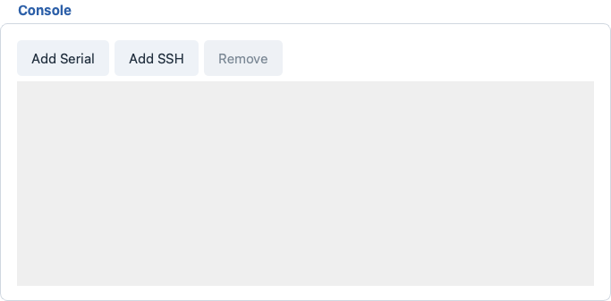

# Console

The **Console** panel is embedded in the bottom-right area of the
**Test Work Flow** page, next to the FCT Test Cases table (50% / 50%
split). It provides multi-channel serial / SSH terminals, quick
command snippets and pop-out console windows. FCT message tests read
the channel read buffers to judge the DUT output.

## Channels

- **1-4 serial channels** (`SER1` ... `SER4`) and **0-1 SSH channel**
  (`SSH1`), each shown as one compact row.
- Per-channel accent colors identify the channels at a glance:
  - `SER1` green, `SER2` yellow, `SER3` orange, `SER4` red.
  - `SSH1` blue.
- One serial channel always exists; with no project YAML loaded the
  panel is cleared and `Add Serial` / `Add SSH` rebuild rows.
- Loading a project applies the YAML `console` section: existing
  channels of the same kind are reused in order, missing ones are
  added, and the YAML channel keys are remembered for the pre-FCT
  auto-connect.

## Channel Row

Each row contains (serial rows differ from SSH rows):

- Colored label badge (`SER1`, ... / `SSH1`).
- Serial: compact **port dropdown** (editable; lists the system ports
  as `COMxx  -  description`; the popup widens to the longest entry)
  and an editable **baud** dropdown (default `115200`).
- SSH: **host** field (e.g. `192.168.1.10`), **port** spin box
  (1-65535, default 22) and **user** field (e.g. `root`).
- `Open` / `Close` button - connects / disconnects the channel. When
  connected the button reads `Close` in red.
- `Console` button - opens the pop-out console window.
- `⚙` button - advanced connection parameters dialog.
- `×` button - removes the channel (it is closed first). The top-bar
  `Remove` button removes the last channel.
- `RX: n  TX: n` - live byte counters per channel.

### Connection Parameters

The `⚙` dialog (or a double-click inside the console output area)
opens the per-channel settings:

- **Serial Connection Settings**: `Port` (dropdown + `Refresh`),
  `Baud` (editable), `Data bits` (default 8), `Parity` (default None),
  `Stop bits` (default 1) and `HW flow control (RTS/CTS)`.
- **SSH Connection Settings**: `Host`, `Port`, `User`, `Password`
  (masked).
- Changes while a channel is online are applied on the next `Open`.

### Open / Close Behavior

- `Open` first copies the inline row fields into the channel
  parameters.
- In Real mode the endpoint must be configured: with no serial port
  (or no SSH host) set, the parameters dialog opens automatically and
  the channel is not opened until a valid endpoint exists.
- The connection is established in a background worker thread; the
  console log shows `Connected <port> @ <baud>` (serial) or
  `Connected <user>@<host>:<port>` (SSH) and later
  `Channel disconnected`.
- **Virtual mode** needs no hardware: serial channels open a simulated
  DUT (boot log, shell prompt, rule-based command replies), SSH shows
  a simulated connection banner.
- `Close` stops the worker; the log content is kept.

## Console Log Area

The full console widget lives in the pop-out window (below); its log
area offers:

- `Timestamp` - prefix every line with `[HH:MM:SS.mmm]` (default on).
- `HEX` - render incoming bytes as hex pairs instead of text.
- `Auto scroll` - keep the view at the newest line (default on).
- `Filter...` - only **incoming** lines containing this text
  (case-insensitive) are appended; the already-rendered history stays
  untouched.
- `Clear` - wipe the log view.
- `Save` - write the log to a `.txt` file; the suggested name is the
  channel default plus a timestamp, e.g. `ser1_log_20260110_120000.txt`.
- Received data is parsed for ANSI color sequences; lines containing
  `error` are highlighted red and bold, lines with `warn` /
  `warning` orange.
- Lines are prefixed with the channel accent tag: `RX>>`, `TX>>` or
  `SYS>>`.

## Pop-out Console Window

Click `Console` on a channel row (or reuse the window) to pop out the
dedicated per-channel window (minimum size 1200 x 800). It hosts the
console log area, a quick commands row and a send panel.

- **Closing the window only hides it** - the console keeps receiving
  data in the background, so a hidden channel never loses RX bytes.
- Window geometry, log font (`Font...` button) and background color
  are remembered per channel and restored on the next open.
- The console background is adjustable in the `View` menu and applies
  to every channel (default black).

## Quick Commands

- The `Quick:` dropdown copies a saved snippet into the Send line
  (its `CR+LF` flag is applied and `HEX` is cleared); press `Enter` /
  `Send` to transmit.
- `Save Cmd` saves the current Send line as a new quick command
  (max 15). Saving a command that already exists only updates its
  `CR+LF` flag instead of duplicating it.
- `Clear Cmd` removes every saved quick command.
- Quick commands persist in `config/commands.json`; built-in defaults
  (`AT`, `ATI`, `ATE0`, `help`, `version`, `status`, `reset`) apply
  when the file is missing.
- All open pop-out windows reload their dropdowns when one window
  saves or clears commands.
- The Send line supports `Up` / `Down` history (last 50 commands) and
  `Tab` completion cycling through history, quick commands and the AT
  command catalog.

## Sending Data

The send panel at the bottom of the pop-out window sends on that
channel:

- Type a command and press `Enter`, or click `Send`.
- `CR+LF` (default on) appends a carriage return + line feed.
- `HEX` sends raw bytes instead of text; use a format such as
  `41 54 0D 0A` (spaces, commas, `0x` prefixes and newlines are
  ignored). Invalid hex input shows a warning and nothing is sent.
- The transmitted line is echoed into the log as `TX>>` and pushed to
  the send history.
- Sending on a disconnected channel logs
  `Channel not connected; data not sent.`

**Warning:** the `HEX` checkbox of the send panel and the `HEX`
checkbox of the log area are independent - one controls what is sent,
the other how received data is displayed.

## FCT Message Tests and the Channel Buffer

Every channel accumulates all received bytes in an internal read
buffer. The FCT console methods use it as follows:

- **Before the FCT stage** the run auto-connects the console channels
  defined by the project YAML (fallback: every channel with a
  configured endpoint) that are still offline. The phase hint shows
  `Connecting console...` (10 s timeout). If any channel cannot be
  connected, an error popup appears, the run stops and the Overall
  Result becomes FAIL.
- `SendtoConsole` - sends the first quoted segment of the step name
  as a command line; the step passes once the payload is written.
- `WaitforConsole` - polls the channel read buffer for the quoted
  keyword(s); any match passes. On timeout: no reply at all -> `Error`,
  a reply without the expected keyword -> `FAIL`.
- `CapturefromConsole` - searches the **whole accumulated buffer**
  instantly (the boot log may already contain the expected keyword).
- `SendtoCLI` / `WaitforCLI` / `CapturefromCLI` - the same three
  behaviors for CLI-style steps.
- Keywords are parsed from quoted segments (`'Pass'` or `"OK"`) of the
  step name; without quotes the text after the last comma (minus the
  `(expected)` marker) is used.
- The step `Timeout` (ms) from the FCT editor bounds the wait
  (default 5000 ms).
- Steps published from the Yaml Build (FCT sequence) run through the
  FCT executor: writes go through the channel transport, reads consume
  the console read buffer. Complete lines are returned once, and a
  trailing partial line (a prompt such as `root@imx93frdm:~#`) is
  re-offered on every read so keyword judges can match prompts.
- Judgement follows the **negative-wins** rule: any `Fail` / `Error`
  keyword beats a later `Pass` in the same captured batch.
- Console steps judge with their own keyword / regex tables from the
  step configuration - the global pass / fail keyword tables are not
  applied to raw DUT output (a boot log contains words like `timeout`
  or `error`, which would cause false negatives).
- In Virtual mode these methods run for real against the simulated
  DUT behind the virtual serial channel.

**Note:** while an FCT console step is pending, the row shows
`Running` in the FCT table and the verdict lands in `Result` together
with the elapsed `Duration (s)`.

## Events in the Event Log

- The Test Work Flow page forwards its log lines to the central
  **Event Log** at the bottom of the main window, stamped
  `YYYY-MM-DD HH:MM:SS` with PASS / FAIL / Error verdicts highlighted.
- Console connect / disconnect, FCT verdicts (e.g. `FCT <step>:
  found 'Pass' -> PASS`) and run-control messages land in the Event
  Log.
- Raw RX / TX traffic stays in the per-channel console log; it is not
  duplicated into the Event Log.
- The Event Log offers a right-click menu (`Copy` / `Clear` /
  `Save as`) and is auto-saved to a session log file per GUI run.
- The status bar shows one LED per console channel, updated live on
  channel add / remove / connect / disconnect.

## Permissions

- `Open` / `Close` (connect / disconnect) and viewing the console /
  pop-out window stay available for every role.
- `Add Serial` / `Add SSH` / `Remove` require the `manage_channels`
  permission.
- Changing parameters (`⚙` dialog and the inline port / baud / host /
  user fields) requires `edit_serial_params`; without it the fields
  are read-only and the dialog shows
  `Operator account cannot change channel parameters.`

## Common Errors and Recovery

- **No ports in the dropdown** - click `Refresh` in the parameters
  dialog, or reconnect the USB-serial adapter.
- **Channel opens but no data** - check baud rate, `CR+LF` flag and
  that the DUT is powered; try the `HEX` log view to see raw bytes.
- **Garbled text** - mismatched baud rate is the usual cause.
- **FCT step ends Error** - the DUT produced no reply at all before
  the timeout (channel closed or DUT silent); **FAIL** means output
  arrived but the expected keyword did not.
- **Pre-FCT connect fails** - verify cable, port name and parameters;
  channels connected manually beforehand are skipped by the
  auto-connect, so opening them before pressing Run is a valid
  workaround.
- **Quick command limit reached** - the maximum is 15; remove unused
  entries by editing `config/commands.json`.
